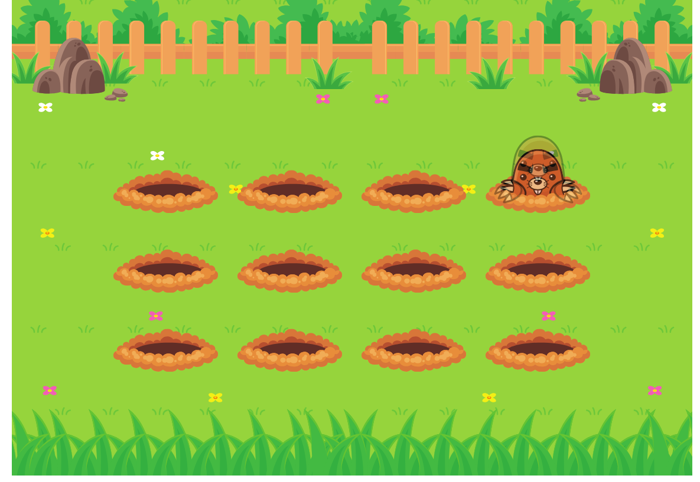

# Projeto Nível 03 - Deasfio de Animação CSS - Toupeiras

> Trilha Explorer Projeto feito na aula nivel 03 construído no curso Explorer da Rocketseat :rocket:.

## :hammer_and_wrench: Tecnologias

- HTML
- CSS
- Git e Github

## :nut_and_bolt: Neste projeto aprendi

- Posicionamento de elementos na página
- Animação CSS

## :mailbox_closed: Contatos

> Email - rosendc30@gmail.com

> Linkedin - https://www.linkedin.com/in/francisco-rosendo-a05623241/